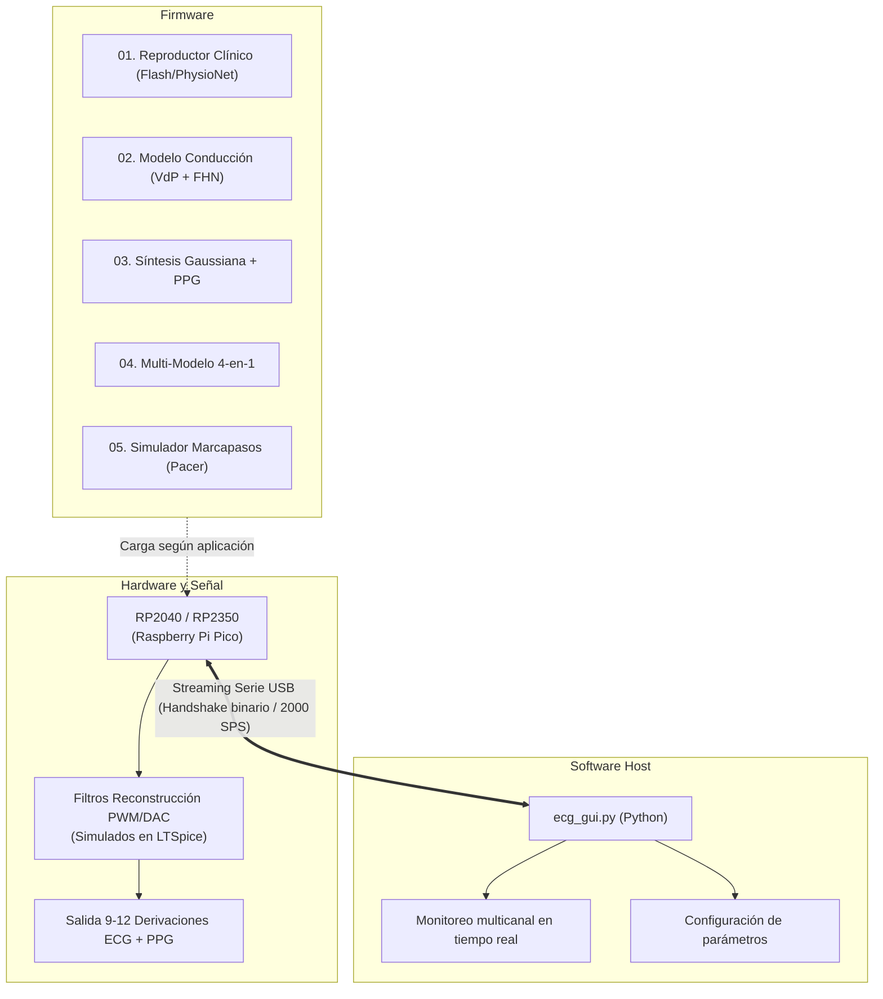

# Fantoma ECG

[](#)
[](#)
[](#)
[](#)

Simulador y calibrador de señales electrocardíacas multicanal. Este proyecto integra el diseño de hardware analógico/digital, simulaciones de filtrado en LTSpice, implementaciones de firmware para RP2040 y RP2350, y software de control en Python.

## Arquitectura del sistema



## Estructura del repositorio

* [`hardware/`](./hardware/): Proyecto KiCad (`pico_ecg`), esquemáticos, PCB, huellas, modelos 3D, Gerber y BOM.
* [`simulaciones/`](./simulaciones/): Circuitos LTSpice para filtrado analógico (PWM a voltaje), detección de impulsos y scripts en Python.
* [`firmware/`](./firmware/): Código para Raspberry Pi Pico y Pico 2:
  * [`01_pico_ecg`](./firmware/01_pico_ecg/): Reproductor de registros clínicos guardados en memoria Flash.
  * Módulos adicionales en desarrollo (`02_pico_conduction_model` a `05_pace_sim`).
* [`software/`](./software/): Interfaz de escritorio en Python para visualización multicanal, registro de datos y control remoto.
* [`datasets/`](./datasets/): Registros de bases clínicas (PhysioNet, LUDB) y scripts para convertirlos a arreglos en C (`.h`).
* [`docs/`](./docs/): Protocolo de comunicación, referencias bibliográficas y notas de diseño.

## Características

* Salida de derivaciones estándar (I, II, III, aVR, aVL, aVF, V1-V6) y canal auxiliar PPG.
* Generación analógica a electrodos y transmisión serie por USB (hasta 2000 SPS).
* Control local mediante menú en pantalla OLED y encoder rotativo, o remoto desde la GUI en Python.
* Simulación de ritmos normales y patologías (taquicardia, bradicardia, fibrilación, bloqueos AV, deriva de línea base).

## Inicio rápido

### Dependencias de software (GUI)

```bash
cd software
python -m venv .venv

# En Windows:
.venv\Scripts\activate

# En Linux/macOS:
source .venv/bin/activate

pip install -r requirements.txt
python ecg_gui.py
```

### Carga de firmware

1. Navegar a la carpeta del firmware deseado (por ejemplo, [`firmware/01_pico_ecg/`](./firmware/01_pico_ecg/)).
2. Conectar la Raspberry Pi Pico manteniendo presionado el botón BOOTSEL.
3. Copiar el archivo `.uf2` compilado a la unidad USB generada.

## Estado del desarrollo

- [x] Caracterización y simulación de filtros pasa-bajos en LTSpice.
- [x] Firmware base `01_pico_ecg` para reproducción de registros clínicos.
- [ ] Desarrollo e integración de firmwares sintéticos (`02_pico_conduction_model` a `05_pace_sim`).
- [x] Diseños finales de PCB y acondicionamiento de señal en KiCad.
- [x] GUI en Python para captura en tiempo real, registro a CSV y compilación a ejecutable.

## Licencia

Este proyecto está bajo la Licencia MIT. Ver el archivo [`LICENSE`](./LICENSE) para más detalles.

