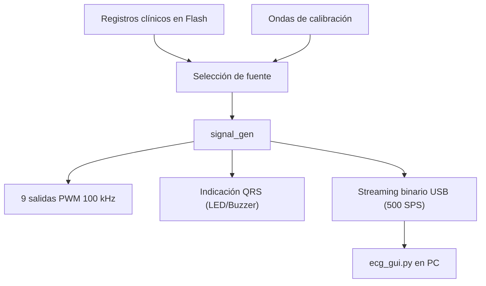

# Monitor y Reproductor ECG pico_ecg

Plataforma de reproducción y monitoreo de electrocardiografía basada en Raspberry Pi Pico y Pico 2 (RP2040 / RP2350). Permite la reproducción de registros electrocardíacos almacenados en memoria flash, generación de ondas sintéticas, control por menú OLED con encoder, consola CLI interactiva y transmisión serie en tiempo real.

## Características

- **Reproducción de registros clínicos**: Señales ECG de 9 derivaciones provenientes de bases de datos como LUDB, guardadas en flash.
- **Generador de calibración**: Ondas sintéticas (Seno, Cuadrada, Triangular, Pulso).
- **Salida PWM (100 kHz)**: Generación analógica de 9 potenciales de electrodos (RA, LA, LL, V1–V6) mediante PWM filtrado.
- **Menú OLED (GEM)**: Interfaz gráfica en pantallas OLED (SH1106 / SSD1306 vía SPI) controlada por encoder rotativo.
- **Consola CLI USB CDC**: Interfaz de comandos en tiempo real por el puerto serie USB.
- **Streaming binario**: Emisión de paquetes binarios (float32) a 500 SPS compatibles con el software en Python.
- **Indicación QRS**: LED y buzzer piezoeléctrico sincronizados con la onda R.

## Hardware y mapeo de pines

| Periférico | Pin GPIO | Descripción |
| :--- | :--- | :--- |
| **PWM RA (Ref)** | GPIO 0 | Brazo Derecho (Referencia 0V) |
| **PWM LA (Deriv I)** | GPIO 1 | Brazo Izquierdo |
| **PWM LL (Deriv II)**| GPIO 2 | Pierna Izquierda |
| **PWM V1 – V6** | GPIO 3, 4, 6, 7, 8, 9 | Precordiales V1 a V6 |
| **LED QRS** | GPIO 5 | Indicador de pico R |
| **Buzzer** | GPIO 15 | Feedback auditivo QRS |
| **OLED SPI0 DC** | GPIO 16 | Data / Command para display OLED |
| **OLED SPI0 RST** | GPIO 17 | Reset de OLED |
| **OLED SPI0 SCK** | GPIO 18 | Reloj SPI (1 MHz) |
| **OLED SPI0 MOSI**| GPIO 19 | Salida de datos SPI |
| **Encoder Button** | GPIO 20 | Pulsador (Pull-up interno) |
| **Encoder DATA** | GPIO 21 | Canal A |
| **Encoder CLK** | GPIO 22 | Canal B |
| **USB Sense** | GPIO 24 | Detección VBUS |
| **Pico LED** | GPIO 25 | LED integrado |
| **Batería ADC** | GPIO 29 (ADC3) | Medición de batería (divisor de tensión) |

## Interfaz de línea de comandos (CLI)

El puerto USB CDC opera a 115200 baudios. Los comandos se ingresan utilizando el prefijo `>`.

### Comandos disponibles

| Comando | Descripción | Ejemplo |
| :--- | :--- | :--- |
| `> help` | Lista de comandos | `> help` |
| `> set <param> <val>`| Modifica un parámetro | `> set hr 75` |
| `> get [param]` | Consulta parámetros | `> get hr` |
| `> list` | Lista archivos ECG en memoria | `> list` |
| `> play` | Inicia la generación | `> play` |
| `> stop` | Detiene la generación | `> stop` |
| `> stream <on\|off>` | Transmisión binaria a 500 SPS | `> stream on` |
| `> ver` | Versión del firmware | `> ver` |

### Parámetros para comando `set`

- `type <ecg|sine|tri|sq|pulse>`: Tipo de onda.
- `hr <30-240>`: Frecuencia cardíaca (BPM).
- `amp <0-100>`: Amplitud de salida (%).
- `offset <-16384 a 16384>`: Desplazamiento DC.
- `file <0-N>`: Índice del registro ECG en flash.
- `buzzer <on|off>`: Activa/desactiva sonido.
- `led <on|off>`: Activa/desactiva indicador QRS.

## Protocolo binario de streaming

Al ejecutar `> stream on`, se transmiten paquetes binarios a 500 Hz por puerto USB:

```
[0xAA 0x55] [Float CH0] [Float CH1] ... [Float CH8] [0x55 0xAA]
```

- **Cabecera**: 2 bytes Sync `0xAA 0x55`.
- **Datos**: 9 valores `float` (32 bits, IEEE-754 little-endian) correspondientes a RA, LA, LL, V1 a V6.
- **Cierre**: 2 bytes Sync `0x55 0xAA`.
- **Tamaño total**: 40 bytes.

## Diagrama de flujo del firmware



## Estructura del menú OLED (GEM)

Navegación mediante encoder rotativo:
- **Giro**: Desplazar selección / ajustar valores.
- **Pulsación Corta**: Aceptar / Entrar.
- **Pulsación Larga**: Volver / Cancelar.

```
MAIN MENU
├── Signal
│   ├── Type (ECG, Sine, Triangle, Square, Pulse)
│   ├── Heart Rate (30-240 BPM)
│   ├── Amplitude (0-100%)
│   └── Offset
├── Playback
│   ├── Play/Pause
│   └── Loop Enable
├── Output
│   ├── Gain
│   └── Offset
├── Interface
│   ├── LED Mode
│   └── Buzzer
├── Files
│   ├── Select ECG
│   └── File Info
└── System
    ├── Firmware Info
    └── Battery Voltage
```

## Incorporación de nuevas señales (.h)

Para agregar nuevos registros ECG:

1. Convertir el registro a un archivo de cabecera C (`.h`) con la estructura `ecg_struct_t`.
2. Guardar el archivo en `Signals/`.
3. Ejecutar el script: `python fix_signal_headers.py`.
4. Abrir `Drivers/src/signal_registry.c`.
5. Incluir la cabecera: `#include "../../Signals/nuevo_registro.h"`.
6. Añadir el puntero a la tabla `registry[]`: `{ "Nombre", &Estructura_Signal },`.
7. Recompilar y flashear.

## Compilación

Requisitos:
- Pico SDK 2.x.
- CMake y Ninja (o Make).
- Toolchain arm-none-eabi-gcc.

Pasos:
```powershell
mkdir build
cd build
cmake .. -G "Ninja"
ninja
```

Se generará `pico_ecg.uf2`. Copiarlo a la unidad de almacenamiento RPI-RP2 en modo BOOTSEL.

## Fundamento electrofisiológico

El simulador inyecta los potenciales de los electrodos respecto a la referencia común:

- **Derivaciones bipolares**:
  $$I = V_{LA} - V_{RA}$$
  $$II = V_{LL} - V_{RA}$$
  $$III = V_{LL} - V_{LA}$$

Asumiendo $V_{RA} = 0$, se inyecta $V_{LA} = I$ y $V_{LL} = II$.
Las precordiales $V_1$ a $V_6$ se sintetizan en sus correspondientes PWM.

La referencia de Wilson (WCT) es reconstruida por el equipo receptor. El terminal de pierna derecha (RL) debe conectarse a tierra con alta impedancia.