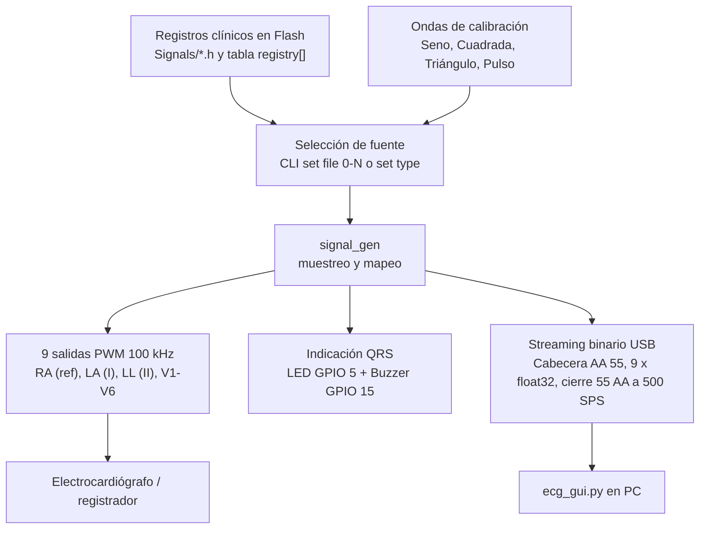

# Monitor y Reproductor de Señales ECG `pico_ecg` (Raspberry Pi Pico / Pico 2)

Plataforma de simulación, reproducción y monitoreo de electrocardiografía (ECG) basada en la **Raspberry Pi Pico / Pico 2 (RP2040 / RP2350)**. Permite la reproducción en tiempo real de registros electrocardíacos clínicos almacenados en memoria flash, generación de ondas sintéticas de prueba, control por menú OLED con encoder, consola CLI interactiva y transmisión de datos serie en tiempo real a 2000 SPS.

---

## 🚀 Características Principales

- **Reproducción de Registros Clínicos**: Carga y reproducción de señales ECG de 9 derivaciones almacenadas en memoria Flash (provenientes de bases de datos como MIT-BIH o LUDB).
- **Generador de Señales de Calibración**: Salida sintética de ondas en tiempo real (Seno, Cuadrada, Triangular, Pulso).
- **Salida Multicanal PWM (100 kHz)**: Generación analógica de 9 potenciales de electrodos (**RA, LA, LL, V1–V6**) mediante módulos PWM filtrados.
- **Menú Interactivo OLED (GEM)**: Interfaz gráfica desplegada en pantallas OLED (SH1106 / SSD1306 vía SPI) administrada por un codificador rotativo (encoder).
- **Consola CLI USB CDC**: Interfaz de línea de comandos texto en tiempo real que coexiste con el espejo del menú serie.
- **Streaming Binario a 500 SPS**: Emisión de paquetes binarios flotantes en tiempo real (500 Hz) compatibles con la GUI [**`ecg_gui.py`**](../Python/ecg_gui.py).
- **Indicación de Latido (QRS)**: LED parpadeante y tono audible en Buzzer piezoeléctrico sincronizados con la onda R.

---

## 🔌 Hardware y Mapeo de Pines

| Periférico | Pin GPIO | Función / Descripción |
| :--- | :--- | :--- |
| **PWM RA (Ref)** | GPIO 0 | Potencial electrodo Brazo Derecho (Referencia 0V) |
| **PWM LA (Deriv I)** | GPIO 1 | Potencial electrodo Brazo Izquierdo ($V_{LA} = I$) |
| **PWM LL (Deriv II)**| GPIO 2 | Potencial electrodo Pierna Izquierda ($V_{LL} = II$) |
| **PWM V1 – V6** | GPIO 3, 4, 6, 7, 8, 9 | Potenciales Precordiales Directos $V_1$ a $V_6$ |
| **LED Latido QRS** | GPIO 5 | Indicador luminoso de pico R |
| **Buzzer Piezo** | GPIO 15 | Feedback auditivo PWM de latido QRS |
| **OLED SPI0 DC** | GPIO 16 | Data / Command selector para display OLED |
| **OLED SPI0 RST** | GPIO 17 | Hard Reset del display OLED |
| **OLED SPI0 SCK** | GPIO 18 | Reloj SPI (1 MHz) |
| **OLED SPI0 MOSI**| GPIO 19 | Salida de datos SPI |
| **Encoder Button** | GPIO 20 | Pulsador del encoder (Pull-up interno) |
| **Encoder DATA** | GPIO 21 | Canal A / DATA del encoder |
| **Encoder CLK** | GPIO 22 | Canal B / CLK del encoder |
| **USB Sense** | GPIO 24 | Detección de alimentación por bus USB |
| **Pico Board LED** | GPIO 25 | LED integrado (indicador de estado del sistema) |
| **Batería ADC** | GPIO 29 (ADC3) | Monitoreo de tensión de batería (Divisor 1/3) |

---

## 🖥️ Interfaz de Línea de Comandos (CLI)

El puerto USB CDC funciona a **115200 baudios**. La consola permite el envío directo de comandos texto utilizando el prefijo `>` sin interrumpir el funcionamiento del menú OLED ni del generador de señales.

### Comandos CLI Disponibles

| Comando | Descripción | Ejemplo de Uso |
| :--- | :--- | :--- |
| `> help` | Muestra la lista de comandos disponibles | `> help` |
| `> set <param> <val>`| Modifica un parámetro de la señal o interfaz | `> set hr 75` |
| `> get [param]` | Consulta el valor actual de los parámetros | `> get hr` o `> get` |
| `> list` | Lista los archivos ECG almacenados en memoria Flash | `> list` |
| `> play` | Inicia la generación / reproducción de la señal | `> play` |
| `> stop` | Detiene la generación / reproducción de la señal | `> stop` |
| `> stream <on\|off>` | Activa / desactiva la transmisión binaria a 500 SPS | `> stream on` |
| `> ver` | Muestra la versión actual del firmware | `> ver` |

### Parámetros Editables mediante `set`

- `type <ecg|sine|tri|sq|pulse>`: Cambia el tipo de forma de onda.
- `hr <30-240>`: Ajusta la frecuencia cardíaca en BPM (Beats Per Minute).
- `amp <0-100>`: Porcentaje de la amplitud de salida.
- `offset <-16384 a 16384>`: Ajuste del nivel DC / desplazamiento vertical.
- `file <0-N>`: Selecciona el índice del registro ECG cargado en flash.
- `buzzer <on|off>`: Activa o desactiva el feedback sonoro.
- `led <on|off>`: Activa o desactiva la indicación luminosa QRS.

---

## 📡 Protocolo Binario de Streaming en Tiempo Real

Cuando se ejecuta el comando `> stream on`, la placa inicia la transmisión continua de paquetes binarios a **500 Hz por canal** (adaptado al ritmo de adquisición original de la base de datos LUDB) a través del puerto USB serie:

```
[0xAA 0x55] [Float CH0] [Float CH1] ... [Float CH8] [0x55 0xAA]
```

- **Cabecera**: 2 bytes Sync `0xAA 0x55`
- **Cuerpo de Datos**: 9 valores `float` de 32 bits (IEEE-754 little-endian, 36 bytes en total) correspondientes a **RA, LA, LL, V1, V2, V3, V4, V5, V6**.
- **Cierre**: 2 bytes Sync `0x55 0xAA`
- **Tamaño total del frame**: 40 bytes.

Este protocolo es decodificado automáticamente por la GUI Python [`ecg_gui.py`](../Python/ecg_gui.py).

---

## 🔀 Diagrama de Flujo del Sistema



---

## 📱 Estructura del Menú OLED (GEM)

Navegación mediante el **encoder rotativo**:
- **Giro**: Desplazar selección o ajustar valores.
- **Pulsación Corta**: Aceptar / Entrar a submenú.
- **Pulsación Larga**: Volver / Cancelar.

```
MAIN MENU
├── Signal
│   ├── Type → ECG, Sine, Triangle, Square, Pulse
│   ├── Heart Rate → 30 - 240 BPM (editable)
│   ├── Amplitude → 0 - 100% (editable)
│   └── Offset → -16384 .. +16384 (editable)
├── Playback
│   ├── Play/Pause (Toggle)
│   └── Loop Enable (Toggle)
├── Output
│   ├── Gain (editable)
│   └── Offset (editable)
├── Interface
│   ├── LED Mode → QRS Blink, Always On, Off
│   └── Buzzer → Enabled / Disabled
├── Files
│   ├── Select ECG (Lista dinámica de archivos en memoria)
│   └── File Info
└── System
    ├── Firmware Info (ver)
    └── Battery Voltage (ADC3)
```

---

## 📊 Incorporación de Nuevas Señales (.h)

Para agregar nuevos registros ECG al simulador:

1. **Convertir el registro**: Convertir la señal a un archivo de cabecera C (`.h`) definiendo la estructura `ecg_struct_t`.
2. **Guardar en el proyecto**: Colocar el archivo `.h` dentro del directorio `Signals/`.
3. **Formatear sintaxis**: Ejecutar el script helper en Python para garantizar compatibilidad:
   ```powershell
   python fix_signal_headers.py
   ```
4. **Registrar en la tabla**:
   - Abrir `Drivers/src/signal_registry.c`.
   - Incluir la cabecera: `#include "../../Signals/Mi_Nueva_Senal.h"`.
   - Agregar el puntero en la tabla `registry[]`: `{ "Mi_Senal", &Mi_Estructura_Signal },`.
5. **Recompilar**: Compilar y flashear el firmware.

---

## 🛠️ Instrucciones de Compilación y Flasheo

### Requisitos Prerequisito
- **Pico SDK 2.x** configurado en el entorno (`PICO_SDK_PATH`).
- **CMake** (v3.13+) y **Ninja** o **Make**.
- Cadena de herramientas **`arm-none-eabi-gcc`**.

### Pasos de Compilación

```powershell
# 1. Crear y entrar al directorio de build
mkdir build
cd build

# 2. Configurar el proyecto con CMake
cmake .. -G "Ninja"

# 3. Compilar el binario
ninja
```

Se generará el archivo `pico_ecg.uf2`. Mantenga presionado el botón **BOOTSEL** de la Raspberry Pi Pico al conectarla por USB y copie el archivo `.uf2` a la unidad de almacenamiento masivo **RPI-RP2**.

---

## 📐 Fundamento Electrofisiológico – Modelo de Electrodos

El simulador excita directamente los potenciales de los electrodos respecto a la referencia común:

- **Derivaciones Bipolares de Einthoven**:
  $$I = V_{LA} - V_{RA}$$
  $$II = V_{LL} - V_{RA}$$
  $$III = V_{LL} - V_{LA}$$

- **Asignación de Potenciales**:
  Tomando $V_{RA} = 0$, se inyecta $V_{LA} = I$ y $V_{LL} = II$. Las derivaciones precordiales $V_1$ a $V_6$ se sintetizan directamente en sus respectivos pines PWM.

- **Wilson Central Terminal (WCT)**:
  El equipo de registro ECG receptor reconstruye la referencia WCT como:
  $$WCT = \frac{V_{RA} + V_{LA} + V_{LL}}{3}$$

- **Electrodo Pierna Derecha (RL / RLD)**:
  El pin de referencia **RL** se conecta a tierra mediante una alta impedancia (~100 kΩ) permitiendo el cierre del lazo activo RLD del electrocardiógrafo sin distorsión.