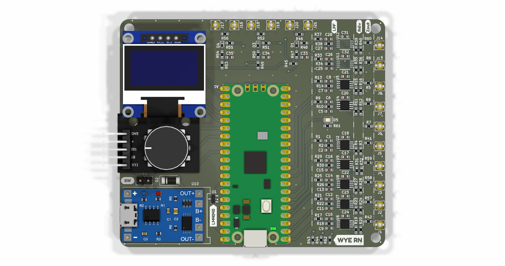
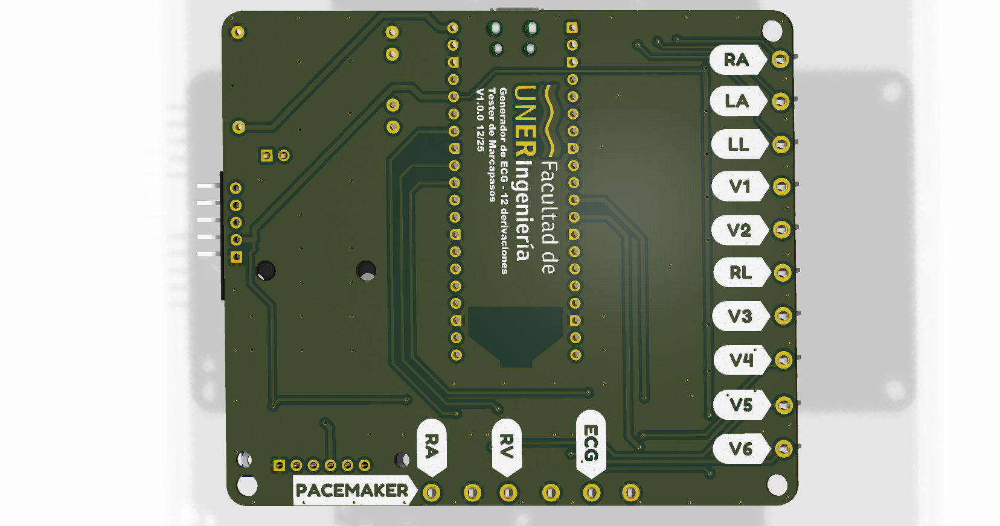
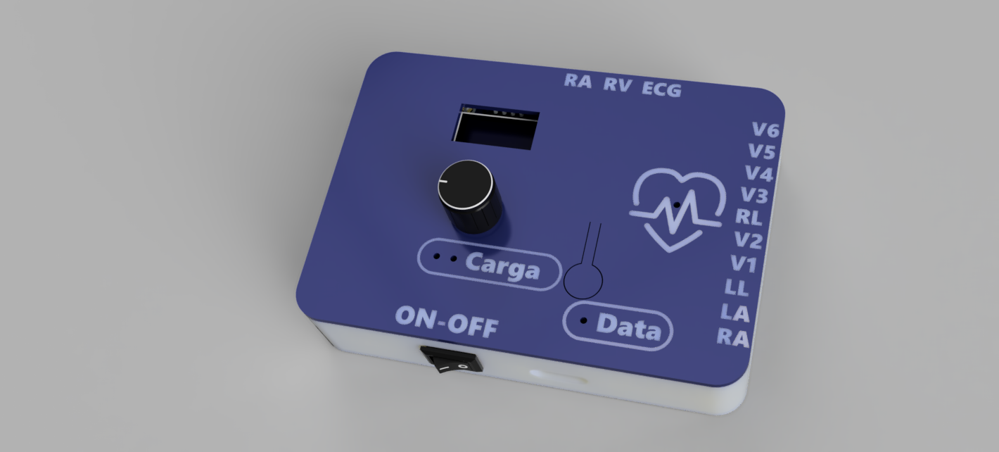
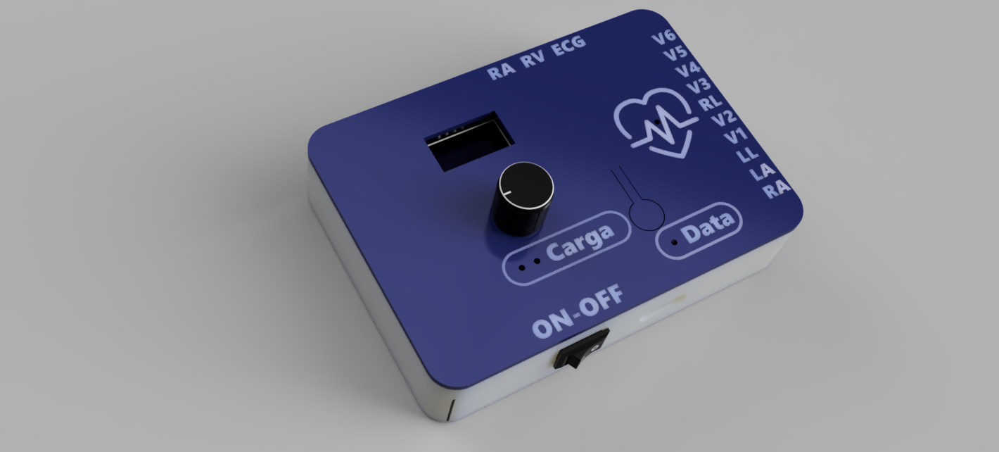

# Diseño de Hardware (KiCad)

Este directorio contiene el diseño electrónico y mecánico del Fantoma ECG, organizado como un proyecto unificado en KiCad.

## Estructura del proyecto

### Archivos de diseño KiCad

- **`pico_ecg.kicad_pro`**: Archivo principal del proyecto KiCad.
- **`pico_ecg.kicad_sch`**: Esquema de circuito principal (etapa analógica, microcontrolador y conectores).
- **`filtros.kicad_sch`**: Sub-esquema de la etapa de filtrado analógico.
- **`pacemaker.kicad_sch`**: Sub-esquema del simulador de marcapasos.
- **`pico_ecg.kicad_pcb`**: Ruteo de la placa de circuito impreso (PCB).

### Directorios

- **`pico_ecg.pretty/`**: Librería de huellas (footprints) locales utilizadas en el diseño — incluye huellas para OLED, Raspberry Pi Pico, cargador TP4056, encoder rotativo, entre otros.
- **`3d_models/`**: Modelos 3D de componentes (STEP/WRL) para visualización en KiCad — incluye Raspberry Pi Pico, OLED 0.96", cargador LiPo, encoder rotativo, y el ensamblaje completo (`pico_ecg.step`).
- **`case/`**: Archivos STL para impresión 3D del gabinete del dispositivo (`base.stl`, `frente.stl`) y fotografías del ensamblaje.
- **`gerber/`**: Archivos de fabricación (Gerber) y de perforación (Drill) listos para enviar a fabricación.
- **`bom/`**: Lista de materiales (`pico_ecg_BOM.csv`) con referencias de componentes, valores y huellas.
- **`docs/`**: Esquemático exportado en PDF (`pico_ecg.pdf`) para revisión rápida sin necesidad de KiCad.
- **`images/`**: Renderizados de la PCB y esquemas de filtrado.

## Imágenes

