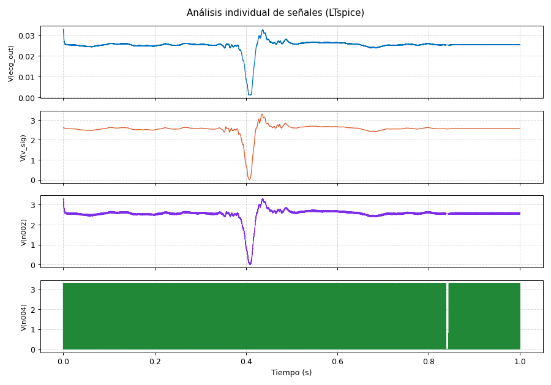
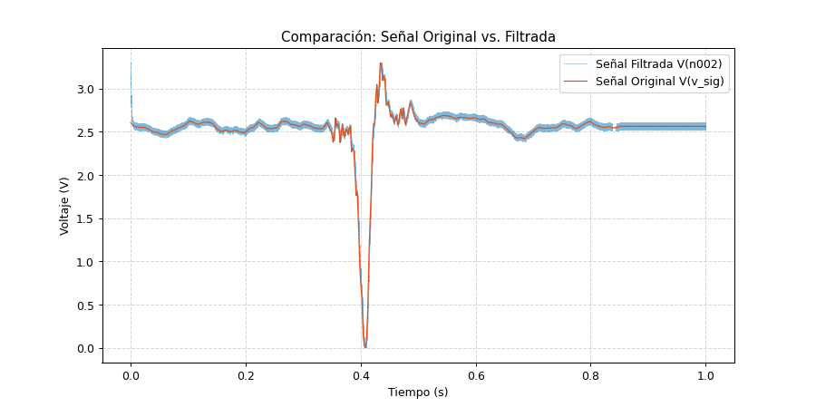

# Simulaciones de Circuitos y Filtros

Modelos en LTSpice y scripts de procesamiento en Python para el diseño, simulación y validación de las etapas analógicas del Fantoma ECG.

## Contenido del directorio

### 1. Modelos de circuito (`ltspice/`)

* **`filter_pwm.asc`**: Simulación transitoria en el dominio del tiempo del filtro pasa-bajos activo/pasivo. Modela la reconstrucción analógica continua a partir de la señal modulada por ancho de pulsos (PWM) generada por el microcontrolador.
* **`filter_pwm_ac.asc`**: Análisis en el dominio de la frecuencia (barrido AC / Diagrama de Bode) para determinar la frecuencia de corte (-3 dB), la linealidad en la banda de paso médica (0.05 Hz – 150 Hz) y la atenuación de la frecuencia portadora PWM.
* **`pace_input_circuit.asc`**: Etapa analógica de acondicionamiento y sensado para detección de impulsos y espigas de marcapasos artificiales.

### 2. Estímulos y tablas de tensión PWL (`ltspice/`)

* **`ecg_pwl.txt`**: Datos de señal electrocardíaca formateados en pares `(tiempo, voltaje)` para alimentar fuentes dependientes PWL en simulaciones transitorias.
* **`ECG-LTSPICE.txt`**: Trazado cardíaco en sintaxis nativa de LTSpice `(t1 v1 t2 v2 ...)`.
* **`pace_pulse_train_rc.txt`**: Tren de pulsos periódicos con decaimiento RC característico para probar la respuesta del circuito de detección de marcapasos.

### 3. Scripts de análisis y visualización (`scripts/`)

* **`data_graph.py`**: Script de Python optimizado para procesar datos exportados desde LTSpice:
  * Emplea el motor C de `pandas` para lectura rápida.
  * Implementa submuestreo (`MAX_PUNTOS = 50000`) para renderizado fluido.
  * Genera dos vistas:
    1. Desglose individual: Visualización multicanal de tensiones intermedias.
    2. Comparación de fidelidad: Superposición entre la señal original (`V(v_sig)`) y la señal filtrada (`V(n002)`).
* **`pwm_gen.py`**: Convierte tablas de señales en formato C (`.h`) a archivos de estímulo por tramos PWL (`ecg_pwl.txt`) para LTSpice, normalizando la amplitud al rango dinámico del PWM (0 a 3.3V / 16 bits).
* **`Figure_1.png`**, **`Figure_2.png`**: Gráficas resultantes del análisis temporal.

## Resultados de simulación

| Desglose de Nodos (Figura 1) | Reconstrucción Original vs. Filtrada (Figura 2) |
|:---:|:---:|
|  |  |

## Flujo de trabajo para simulaciones

1. **Abrir y simular en LTSpice:**
   - Abrir `ltspice/filter_pwm.asc` en LTSpice.
   - Ejecutar la simulación Transitoria.
2. **Exportar datos desde LTSpice:**
   - `File` → `Export data as text`.
   - Seleccionar las variables de interés (ej. `V(v_sig)`, `V(n002)`).
   - Guardar como `filter_pwm_out_signals.txt` en `simulaciones/scripts/`.
3. **Generar gráficos:**
   ```bash
   cd simulaciones/scripts
   python data_graph.py
   ```

Nota: Los archivos de simulación de gran tamaño y los binarios generados por LTSpice (.raw, .log) están excluidos del repositorio mediante `.gitignore`.

